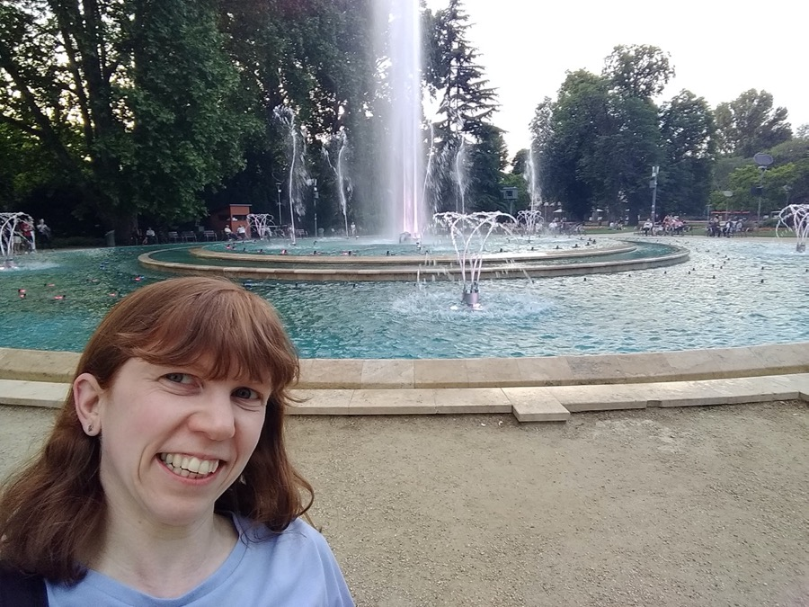

 <!-- markdownlint-disable-line MD041 -->

## Junior Backend Software Engineer

I worked as a Site Reliability Engineer at Dunelm for over 2 1/2 years, where I've learnt all about AWS serverless, monitoring (DataDog) and good coding practices. It was a very demanding role due to both working on SRE projects and being embedded in an engineering team. Although I enjoyed it, I realised that I wanted to focus on the engineering side of things, so I'm now looking for a Software Engineer/Developer role.

I moved into Software Development after spending over 16 years in retail. I used to look after 3 websites, two of which were originally in Word and I redid both in self taught HTML. This combined with me being thorough in my work led to a close friend suggesting programming.

When I took redundancy, I had just started to teach myself C#. I then quickly moved onto Python to get a better understanding of coding. I found I was really enjoying it and in particular seeing the code working! I knew this would be a good job to do going forwards, so I attended Makers Academy Bootcamp.

Going into the Bootcamp I thought my preference would be for frontend but as the course went on, I realised just how much I enjoy doing the logic side of things. Therefore my preference now is Backend Development. As result of attending Makers I now have knowledge of Ruby/Rails/Rspec, JS/Jasmine/Jest as well as Agile working and TDD.

Away from programming I enjoy Scottish Country Dancing, following sport, spending time in Budapest and I'm also learning Hungarian. Through the Scottish dancing I've done various things including participating at the Patron's Lunch and I'm also a qualified Scottish Dance teacher.

Through the various links near the top of this page you'll be able to see what I'm up too!
