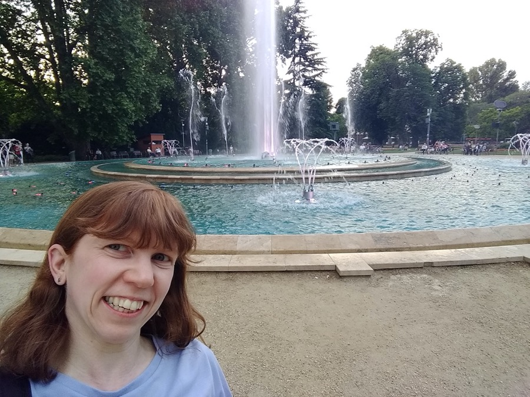

 <!-- markdownlint-disable-line MD041 -->

## Junior Backend Software Engineer

I worked as a Site Reliability Engineer at Dunelm for over 2 1/2 years, where I learnt all about AWS serverless, monitoring (DataDog) and good coding practices. I worked on a number of automated tooling projects within SRE, including one in Python that automatically deleted stale branch stacks from AWS environments. I, along with sone of my colleagues, worked on this project from the start, which included planning and coming up with the architecture for it. Although I enjoyed working in SRE, I realised that I wanted to focus more on the engineering side of things, so I'm now looking for a Software Engineer/Developer role.

I moved into Software Development after spending over 16 years in retail. I used to look after 3 websites, two of which were originally in Word and I redid both in self taught HTML. This combined with me being thorough in my work led to a close friend suggesting programming.

In February 2019 started to teach myself C# but switched to Python 3 months later to get a better understanding of coding. Although I liked C#, it possibly wasn't the best language to start with for me and my friend realised this, so he suggested I look at Python. I was happy to and once I did, I very quickly found that I was really enjoying it, in particular seeing the code working! I knew this would be a good job to do going forwards, so I attended Makers Academy Bootcamp.

Going into the Bootcamp I thought my preference would be for frontend but as the course went on, I realised just how much I enjoy doing the logic side of things. Therefore my preference now is Backend Development. As result of attending Makers I now have knowledge of Ruby/Rails/Rspec, JS/Jasmine/Jest, PostgreSQL as well as Agile working and TDD.

During my time at Makers I enjoyed working on a number of projects including MakersBnB, an airBnB clone, which we did in Ruby and used PostgreSQL as our database. The final project of the course was a charity tool and we used the MERN stack to build. Both of these were group projects and it was great fun working together to build something. One of my tasks in the charity project was to set up a CI/CD pipeline to run tests and automatically deploy it to Heroku. It was a bit harder than anticipated but I was determined to get it working and it was such a good feeling when I did!

Away from programming I enjoy Scottish Country Dancing, following sport, spending time in Budapest and I'm also learning Hungarian. Through the Scottish dancing I've done various things including participating at the Patron's Lunch and I'm also a qualified Scottish Dance teacher.

Through the various links near the top of this page you'll be able to see what I'm up too!
